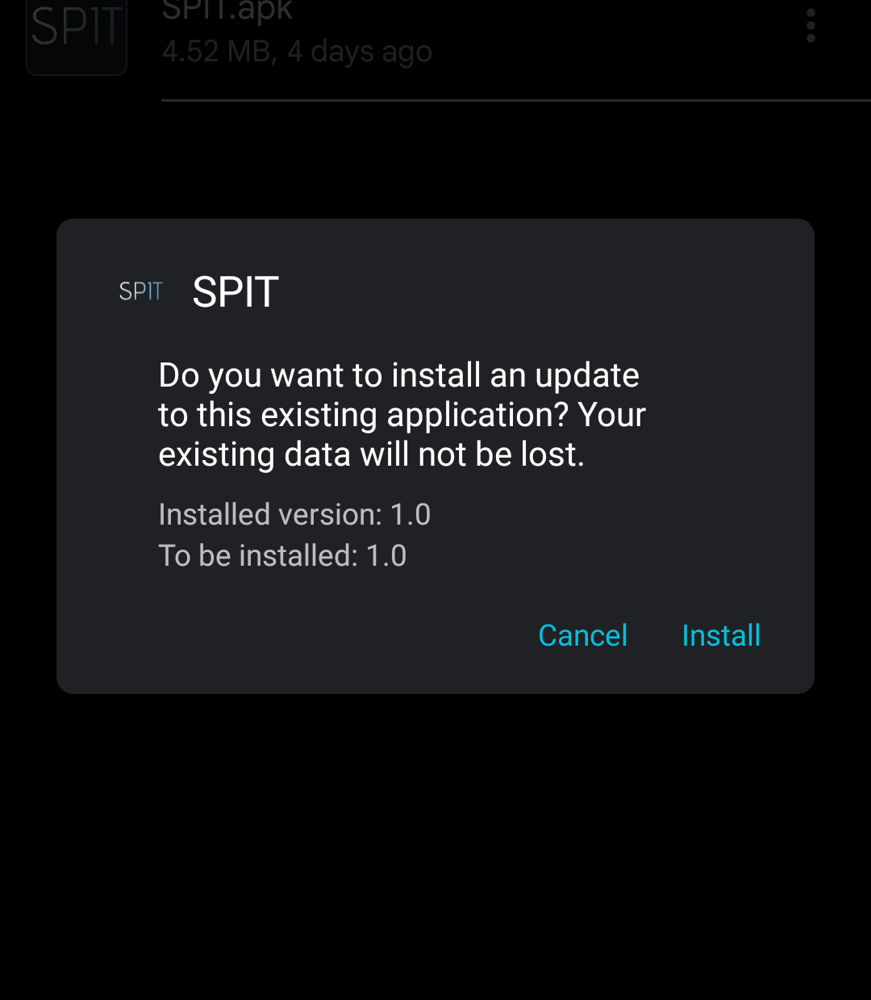
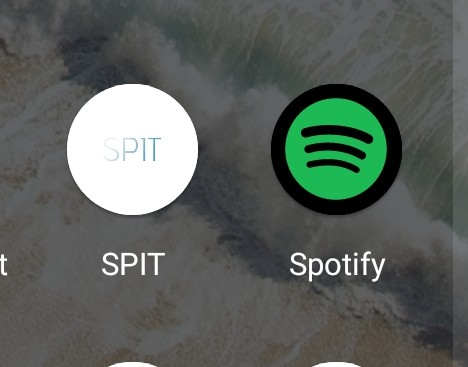

# SPIT (Beta 2023.10.01)

SPIT (Beta 2023.10.01)

Το Spectate IT ή SPIT είναι ένα λογισμικό για να ενημερώνεσαι για κάθε εξέλιξη των μαθημάτων και να μην μένεις απ’ έξω. <b> ΠΡΟΣΟΧΗ Η ΕΦΑΡΜΟΓΗ ΕΙΝΑΙ ΜΟΝΟ ΓΙΑ ΦΟΙΤΗΤΕΣ ΤΟΥ ΤΜΗΜΑΤΟΣ ΜΗΧΑΝΙΚΩΝ ΗΛΕΚΤΡΟΝΙΚΩΝ ΥΠΟΛΟΓΙΣΤΩΝ ΚΑΙ ΠΛΗΡΟΦΟΡΙΚΗΣ ΣΤΟ ΠΑΝΕΠΙΣΤΗΜΙΟ ΙΩΑΝΝΙΝΩΝ </b> . Σε πέριπτωση που δεν είστε μέλος του τμήματος η εφαρμογή δεν θα δουλέψει, Ευχαριστούμε για την δοκιμή. 

# Πως δουλευεί αυτό το μαραφέτι;

Η λειτουργία της εφαρμογής μας είναι εξαιρετικά απλή και αποτελεσματική, εστιάζοντας στην καρδιά της πανεπιστημιακής εμπειρίας. Κάθε φοιτητής, κατά τη σύνδεσή του στην εφαρμογή, επιλέγει μια προσαρμοσμένη λίστα μαθημάτων που τον ενδιαφέρουν και επιθυμεί να παρακολουθήσει. Αυτή η προσωποποιημένη λίστα αποτελεί τον πυρήνα της εφαρμογής και διασφαλίζει ότι κάθε χρήστης λαμβάνει μόνο τις πληροφορίες που τον αφορούν πραγματικά. Έπειτα, όλοι οι φοιτητές έχουν την δυνατότητα να δηλώσουν την κατάσταση των μαθημάτων που παρακολουθούν με σκοπό να ενημερώσουν τους υπόλοιπους φοιτητές που δεν βρίσκονται αυτή την στιγμή στην αίθουσα να καταλάβουν τι έχει διδαχθεί μέχρι στιγμής. Τόσο απλά !

# Ο ρόλος σας είναι πολύτιμος 

Θα θέλαμε σε αυτό το σημείο να ενθαρρύνουμε όλους τους χρήστες-φοιτητές της εφαρμογής να είναι ενεργοί και προσφέροντες προς την κοινότητα. Κάθε φοιτητής μπορεί να συμβάλει ενημερώνοντας την κατάσταση του μαθήματός που παρακολουθούν. Μήπως ο καθηγητής έκανε αλλαγές στο πρόγραμμα; Ενημερώστε τους υπόλοιπους φοιτητές. Μήπως κάποιο μάθημα πάει μία ώρα νωρίτερα από ό,τι ανακοινώθηκε; Βοηθήστε τους άλλους φοιτητές να μη χάσουν το μάθημά τους. Και αν ένα μάθημα ακυρώθηκε ή μεταφέρθηκε, η ενημέρωσή σας είναι πολύτιμη για να μην χάσουν χρόνο και ενέργεια οι συμφοιτητές σας.

Οι φοιτητές είναι το κλειδί για την ανάπτυξη μιας δυναμικής και ενημερωμένης κοινότητας μέσω της εφαρμογής. Οι συνεισφορές σας καθιστούν την εφαρμογή αυτή ξεχωριστή, καθώς βοηθάτε τους συμφοιτητές σας να προοδεύουν και να επιτυγχάνουν τους στόχους τους. Συνεργαζόμενοι ως μια κοινότητα, μπορούμε να διαμορφώσουμε μια πιο ενημερωμένη και αποτελεσματική περίοδο σπουδών για όλους.

Συνεπώς, ας συνεχίσουμε να διαδραματίζουμε τον σημαντικό αυτό ρόλο και να συνεισφέρουμε στην ανάπτυξη αυτής της εξαιρετικής εφαρμογής που βοηθά όλη την κοινότητα του τμήματος μας. Με τη συνεργασία μας, μπορούμε να κάνουμε τη διαδικασία της πανεπιστημιακής μάθησης ακόμη πιο ενδιαφέρουσα και αποτελεσματική για όλους μας.

# Διαδικασία Εγκατάστασης

1) Κατεβάστε το APK Αρχείο πατώντας πάνω εδώ: 
([Download SPIT](https://github.com/Belunka/SPIT/raw/main/SPIT.apk) 📱)

2) Πατήστε πάνω στο αρχείο που σας κατέβηκε (Η προεπιλεγμένη θέση είναι στις 
λήψεις , διαφορετικά ψάξτε στην κάρτα μνήμης).

3) μόλις τελειώσει η εγκατάσταση θα σας εμφανιστεί αυτό το εικονίδιο.

Τέλος, Σε περίπτωση που αντιμετωπίζετε κάποιο σφάλμα με την εφαρμογή , βεβαιωθείτε πρώτα ότι έχετε σύνδεση στο δίκτυο. Μπορείτε επίσης να δηλώσετε το σφάλμα της εφαρμογής είτε χρησιμοποιώντας τον github λογαριασμό σας και πηγαίνοντας στην καρτέλα issues (https://github.com/Belunka/SPIT-Open-Beta-Early-Access-/issues) Ή μπορείτε να μας στείλετε email στο belunka2023@gmail.com. 

Ευχαριστούμε πολύ όσοι κατεβάσατε και δοκιμάζετε την εφαρμογή μας. Είναι πολύ σημαντικό, ειδικά στα πρώτα μας βήματα να λαμβάνουμε feedback σχετικά με την εξέλιξη και την πορεία των λογισμικών μας. Η γνώμη σας είναι σημαντική για εμάς!

